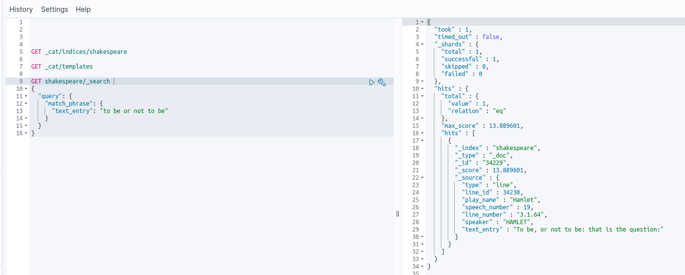
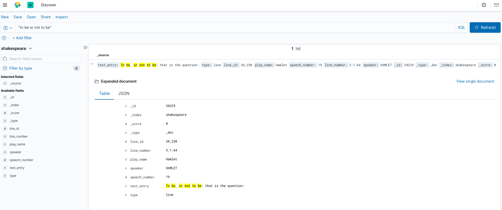

# Введение

В ходе этой лекции мы установим Elasticsearch и зальем туда Шекспира чтобы попробовать поискать его.

## Конфигурация

Конфиг на живой Убунту лежит в `/etc/elasticsearch/elasticsearch.yml`, в Докере `/usr/share/elasticsearch/config/elasticsearch.yml`.

Конфиг нужно обязательно твикать после установки. Конфигурационный файл должен быть следующим:

```
node.name: node-1
network.host: 0.0.0.0
discovery.seed_hosts: ["127.0.0.1"]
cluster.initial_master_nodes: ["node-1"]
```

Проверить работу эластика:

```bash
docker-compose up -d elasticsearch
curl -XGET localhost:9200
```

Ответ:

```json
{
  "name" : "node-1",
  "cluster_name" : "docker-cluster",
  "cluster_uuid" : "mp18xwRnRq287ca-DuN7BA",
  "version" : {
    "number" : "7.8.0",
    "build_flavor" : "default",
    "build_type" : "docker",
    "build_hash" : "757314695644ea9a1dc2fecd26d1a43856725e65",
    "build_date" : "2020-06-14T19:35:50.234439Z",
    "build_snapshot" : false,
    "lucene_version" : "8.5.1",
    "minimum_wire_compatibility_version" : "6.8.0",
    "minimum_index_compatibility_version" : "6.0.0-beta1"
  },
  "tagline" : "You Know, for Search"
}
```

Curl - это утилита для отправки HTTP-запросов из консоли:

```bash
curl -H "Content-Type: application/json" <URL> -d '<BODY>'
```

## Поиск

Теперь у нас есть поисковый движок, загрузим в него что-нибудь. 

```bash
wget http://media.sundog-soft.com/es7/shakes-mapping.json
```

Это просто схема данных, которые мы собираемся залить в Elasticsearch:

```json
{
	"mappings" : {
		"properties" : {
			"speaker" : {"type": "keyword" },
			"play_name" : {"type": "keyword" },
			"line_id" : { "type" : "integer" },
			"speech_number" : { "type" : "integer" }
		}
	}
}
```


Загрузим схему в Elasticsearch:

```bash
curl -H "Content-Type: application/json" -XPUT localhost:9200/shakespeare --data-binary @shakes-mapping.json
```

Теперь загрузим список произведений Шекспира:

```bash
wget http://media.sundog-soft.com/es7/shakespeare_7.0.json
```

Это большой набор данных следующего вида:

```json
{"index":{"_index":"shakespeare","_id":0}}
{"type":"act","line_id":1,"play_name":"Henry IV", "speech_number":"","line_number":"","speaker":"","text_entry":"ACT I"}
```

Видимо, это готовые индексы.

Осталось отправить это в наш индекс:

```bash
curl -H "Content-Type: application/json" -XPOST 'localhost:9200/shakespeare/_bulk' --data-binary @shakespeare_7.0.json
```

Попробуем произвести поиск по этим данным:

```bash
curl -H "Content-Type: application/json" -XGET 'localhost:9200/shakespeare/_search?pretty' -d '
{
  "query": {
    "match_phrase": {
      "text_entry": "to be or not to be"
    }
  }
}
'
```

В ответ приходит следующее:

```json
{
  "took" : 2481,
  "timed_out" : false,
  "_shards" : {
    "total" : 1,
    "successful" : 1,
    "skipped" : 0,
    "failed" : 0
  },
  "hits" : {
    "total" : {
      "value" : 1,
      "relation" : "eq"
    },
    "max_score" : 13.889601,
    "hits" : [
      {
        "_index" : "shakespeare",
        "_type" : "_doc",
        "_id" : "34229",
        "_score" : 13.889601,
        "_source" : {
          "type" : "line",
          "line_id" : 34230,
          "play_name" : "Hamlet",
          "speech_number" : 19,
          "line_number" : "3.1.64",
          "speaker" : "HAMLET",
          "text_entry" : "To be, or not to be: that is the question:"
        }
      }
    ]
  }
}
```

В Кибане это выглядит следующим образом:



Полнотекстовый поиск Кибаны:



