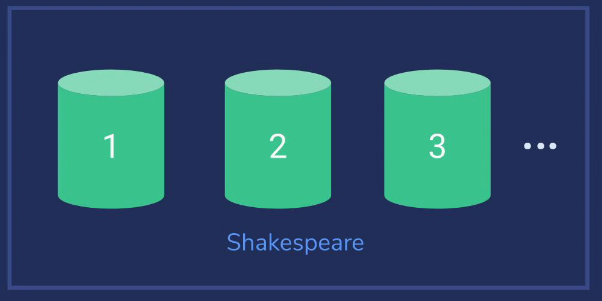
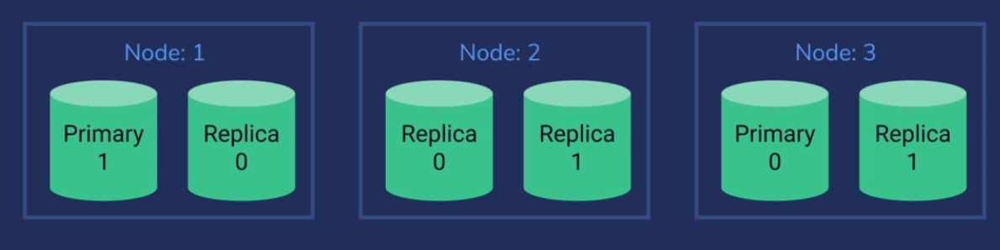

# How Elasticsearch scales

## Индекс распределён по шардам



Индексы ES разделены по **фрагментам** (*shards*). Один индекс может быть разделен на несколько фрагментов. Каждый фрагмент изнутри - это отдельный индекс Lucene. Каждый фрагмент может быть на разном **узле** (*node*) в **кластере** (*cluster*).

Если нужно больше мощностей - можно добавить больше машин в кластер, что добавит больше фрагментов. Так конкретный индекс сможет более эффективно работать под нагрузкой.

Когда мы делаем запрос к какому-то шарду из кластера ES, он определяет, какой документ нужен по этому запросу. Сервер может сделать хэш на основе ID нужного шарда. Так у нас появится функция, позволяющая очень быстро определить, какой шард содержит нужный документ. И тогда он сможет перенаправить нас на нужный шард очень быстро.

## Основные (*Primary*) шарды и шарды-копии (*Replica*)

Предположим, у нас есть индекс с двумя основными шардами и двумя копиями. У нас есть три узла. Обычно одна нода занимает один физический сервер в кластере.
Нода - это одна инсталляция ES:



- Все запросы на запись всегда идут в основные шарды и затем реплицируются;
- Запросы на чтение могут идти в основной шард или в реплицированный;

Это основная фишка ES поверх Lucene - он умеет управляться с репликами и шардами. То, что изображно на картинке, сделает Elasticsearch самостоятельно если дать ему три узла и затребовать две ноды с двумя репликами. 

Предположим, первая нода сломалась. Мы потеряем основной шард 1 и реплику 0. В этой ситуации Elasticsearch назначит основной нодой реплику 1 на узле 2 или на узле 3. Т.е. кластер продолжит выполнять свои функции и можно спокойно восстановить работу узла 1. 

В этой схеме даже два узла могут сломаться (причём любых) - и кластер всё равно продолжит выполнять свою работу. В целом иметь нечётное количество узлов обычно хорошая идея.

### Как происходит запись

Предположим, мы индексируем новый документ - это запись в ES. В этой ситуации произойдёт следующее:

- Любой узел найдет нужный основной шард и сделает редирект запроса на него;
- Данные записываются на основной шард;
- Данные реплицируются в реплики для этого шарда;
- Чтение возможно из любой реплики или основного шарда, поэтому в целом будет происходить быстрее.

Таким образом, повышение количества реплик повышает скорость чтения.
Повышение количества шардов повышает скорость записи.

## Создание индекса

Количество основных шардов в кластере не может быть изменено после создания индекса. Добавлять реплики можно.

Создание индекса:

```json
PUT /testindex
{
    "settings": {
        "numer_of_shards": 3,
        "number_of_replicas": 1
    }
}
```

Статистически запросов на чтение обычно намного больше, чем на запись, поэтому скейлинга по чтению должно хватить для производительности.

Конечно, есть хак и для "добавления" шардов. Можно реиндексировать данные в новый индекс и скопировать их туда. Но лучше спланировать заранее.

### Запрос PUT

Поговорим о том, что делает запрос выше. В данном запросе мы просим создать три основных шарда и одну реплику. Но сколько шардов будет на деле? На деле их будет шесть. Мы ведь хотим три основных шарда и реплику для каждого. 

Эластик автоматически распределит эти шарды по серверам, которые составляют кластер. 
